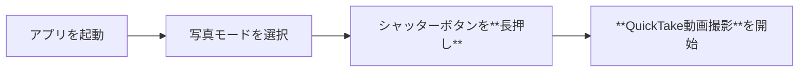

# 主要5アプリ「長押し（ロングタップ）」機能 徹底比較

**Date:** 2025.11.28

> 本日は、スマートフォンを毎日使う中で見落としがちな、**長押し**操作に焦点を当てたプレゼンテーションを行います。LINE、YouTube、Google Maps、Gmail、そしてカメラという、最も利用頻度の高い5つのアプリを取り上げ、それぞれの長押し機能がもたらす時短と効率化のメリットを徹底的に比較分析します。

---

## アジェンダ

**主要5アプリの長押し機能を個別に解説し、その傾向を分析・比較します**

- 長押し機能の重要性と3つのメリット
- コミュニケーションアプリの事例：LINE
- エンタメ系アプリの事例：YouTube
- 地図・ナビゲーションアプリの事例：Google Maps
- メール・仕事系アプリの事例：Gmail
- 標準アプリの事例：カメラ
- 長押し機能の傾向と使い分け比較
- まとめ

> 本日のアジェンダです。まずは長押し操作の重要性とその基本分類を解説し、その後、主要5つのアプリごとに具体的な長押し活用術をご紹介します。最後に、これらのアプリの長押し機能を比較し、それぞれの傾向と使い分けについて考察します。

---

## LINE：コミュニケーションを円滑にする裏技

**通知やトークリストの長押しで、見たい情報に即座にアクセスできます**

- **トークリスト長押し**
  - **既読をつけずに**メッセージをプレビュー
- **ホームアイコン長押し**
  - QRコードリーダーや**新規トーク**を即座に起動
- **スタンプ長押し**
  - 送る前にスタンプの内容を**大きく確認**

> 最初にご紹介するのはLINEです。LINEの長押し機能で最も有名かつ便利なのは、トークリストで特定のトークを長押しし、指を離さずにプレビューすることで、相手に既読をつけずにメッセージを読むことができる機能です。また、ホームアイコンを長押しすると、QRコードや新規トーク作成といった、よく使う機能を即座に起動できます。スタンプの長押しは、送る前にその動きを大きく確認できる、地味ながら便利な機能です。

---

## YouTube：動画体験を高速化する操作

**長押し操作は「スピードの調整」と「情報確認」に特化しています**

| 機能 | 説明 |
| :--- | :--- |
| **再生画面の長押し** | 動画を**2倍速**で再生し、時間を節約 |
| **サムネイルの長押し** | 動画を開かずに**プレビュー再生**を開始 |
| **シークバー長押し** | 秒単位での**ピンポイント**な位置調整 |
| **コメント長押し** | 特定のコメントを**選択・コピー**して引用 |

> YouTubeの長押しは、動画視聴体験を快適にするためのものです。再生中に画面を長押しすると、再生速度が自動的に2倍速になります。特に学習系の動画や冗長な部分を早く見たいときに非常に有効です。また、サムネイルを長押しすることで、動画をフルで開く前に内容を素早く確認できます。シークバーの長押しによる微調整も、見たいシーンに素早く移動するのに役立ちます。

---

## Google Maps：素早い地点登録と経路検索

**長押しは「場所の指定」と「情報の取得」の起点となります**

1. 地図上の任意の場所を長押しし、**赤いピン**をドロップ
2. ピンが立ったことでその場所の**正確な緯度経度**を確定
3. 画面下のパネルから「経路」や「共有」などの**関連操作**を即実行
4. 住所やピンを解除せずに他の場所を検索し、**距離測定**を開始

> Google Mapsでは、長押しは「地点の指定」という重要な役割を果たします。地図上のどこでも長押しすると赤いピンが立ち、その場所の正確な情報、つまり緯度経度を取得できます。これにより、住所がない場所でも簡単に地点を共有したり、そこを目的地にした経路検索を素早く始められます。さらに、2つの地点にピンを立てることで、その間の距離を測定することも可能です。

---

## Gmail：効率的なメール処理への切り替え

**長押しは、メールを「閲覧モード」から「操作モード」へ切り替えます**

| 通常のタップ操作（閲覧モード） | メールの長押し操作（選択モード） |
| :--- | :--- |
| メールを個別に開き、内容を閲覧 | 複数のメールを**チェックボックスで選択** |
| 返信や転送などの単一操作に移行 | アーカイブ、削除、既読などの**一括操作**が可能 |
| 処理に時間がかかり、一括処理には不向き | ドラッグ＆ドロップによるフォルダ移動（タブレット） |

> Gmailにおける長押し操作は、操作モードの切り替えを意味します。通常のタップはメールを単体で開いて内容を閲覧する『閲覧モード』ですが、メールを長押しすると『選択モード』に移行します。これにより、複数のメールを一括で選択し、まとめてアーカイブしたり、削除したりといった操作が可能になり、大量のメール処理が格段に効率化されます。

---

## カメラ：決定的な瞬間を逃さない高速起動

**写真モードから動画撮影へ、シームレスな移行を実現します**

> 標準のカメラアプリでは、長押し操作がシャッターボタンに割り当てられています。通常、動画を撮るにはモードを切り替える必要がありますが、長押しすることで、現在写真モードであっても、指が触れている間だけ動画撮影（QuickTake）を開始できます。これは、シャッターチャンスを逃したくない、決定的な瞬間を記録する上で、非常に重要な機能です。

---

## 長押し機能の傾向と使い分け：比較一覧

**各アプリの長押し機能は、利用シーンに応じて明確な役割分担がされています**

| アプリ | 主な機能 | 機能分類 | 目的 |
| :--- | :--- | :--- | :--- |
| **LINE** | 既読回避、クイックメニュー | プレビュー/ショートカット | **秘密保持**と**時短起動** |
| **YouTube** | 2倍速再生、サムネイルプレビュー | モード切替/プレビュー | **視聴効率化**と**情報選別** |
| **Google Maps** | ピン留め、距離測定 | データ入力/データ取得 | **正確な位置指定**と**情報共有** |
| **Gmail** | 複数選択、一括アーカイブ | モード切替/一括操作 | **大量メール処理**と**効率化** |
| **カメラ** | シャッター長押しで動画 | モード切替/高速撮影 | **瞬間的な記録**と**シームレスな移行** |

> 5つのアプリの長押し機能をまとめると、このように分類できます。LINEとYouTubeは『プレビュー』機能を通じて情報の確認と選別をサポートし、Google Mapsは『データ入力・取得』、Gmailとカメラは『モード切替』による一括操作や高速撮影を可能にします。長押しは、それぞれ異なる目的で、ユーザーの操作を劇的に効率化していることがわかります。

---

## まとめ

> 長押し操作は、スマートフォンが持つ『隠された便利な機能』の代表格です。たった一本の指で、日々のアプリ操作を劇的に効率化し、時短に繋げることができます。今日ご紹介した機能が、皆様のスマートフォン活用の一助となれば幸いです。ご清聴ありがとうございました。
