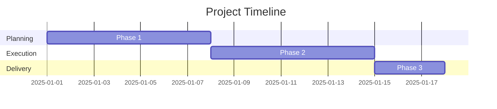

# 🎯 Project: {{project}}

## 📌 Executive Summary
**一行説明**: 

**プロジェクトの目的**: 

**想定成果**: 

## 🎯 Goals & Success Metrics

### Primary Goals
1. 
2. 
3. 

### Success Criteria
- [ ] 指標1: 
- [ ] 指標2: 
- [ ] 指標3: 

## 👥 Stakeholders

| Role | Name | Responsibility |
|------|------|----------------|
| Owner | {{owner}} | 全体統括 |
| Client | | |
| Partner | | |
| Audience | | |

## 📦 Deliverables

### Main Deliverables
- [ ] 成果物1:
  - 詳細:
  - 期限:
  
- [ ] 成果物2:
  - 詳細:
  - 期限:

## 📅 Timeline & Milestones

### Key Milestones
- [ ] Milestone 1: (YYYY-MM-DD) 
  - 達成条件:

- [ ] Milestone 2: (YYYY-MM-DD) 
  - 達成条件:

- [ ] Milestone 3: (YYYY-MM-DD) 
  - 達成条件:

## 📊 Current Status

**Overall Progress**: ____%

[████████░░░░░░░░░░░░] 40%

### This Week's Focus

### Blockers & Risks
- 🚧 Blocker: 
  - Impact:
  - Mitigation:

## 💰 Budget & Resources

### Budget
- 予算: ¥______
- 実績: ¥______
- 残高: ¥______

### Required Resources
- [ ] 人的リソース:
- [ ] ツール・サービス:
- [ ] 外部発注:

## 🔗 Related Documents
- [[Requirements Document]]
- [[Project Plan]]
- [[Timeline]]
- [[Materials]]
- [[Retrospective]]

## 📝 Project Log

### YYYY-MM-DD - タイトル

## 🎯 Next Actions
- [ ]
- [ ]
- [ ]
