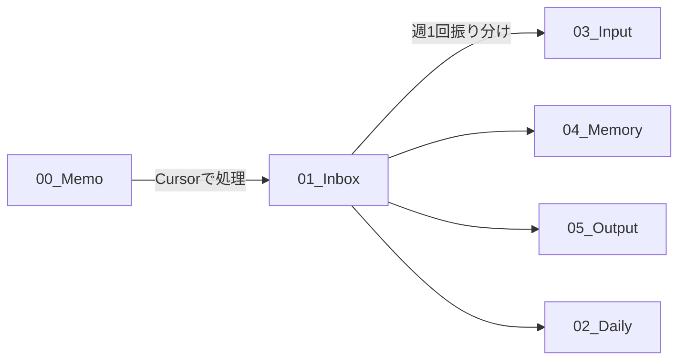

# 🧠 汎用セカンドブレイン - Brain System Rules

**バージョン**: 1.0  
**最終更新**: 2025-01-13  
**対象**: AI、新メンバー、未来の自分

---

## 📖 目次

1. [システム全体の哲学](#システム全体の哲学)
2. [フォルダ構成の全体像](#フォルダ構成の全体像)
3. [各フォルダの詳細ルール](#各フォルダの詳細ルール)
4. [ファイル命名規則](#ファイル命名規則)
5. [タグ付けルール](#タグ付けルール)
6. [双方向リンクの使い方](#双方向リンクの使い方)
7. [日々のワークフロー](#日々のワークフロー)
8. [よくある質問と回答](#よくある質問と回答)
9. [具体例で学ぶ](#具体例で学ぶ)
10. [トラブルシューティング](#トラブルシューティング)

---

## 🎯 システム全体の哲学

### このシステムが目指すもの

このObsidianシステムは、**人間の脳の情報処理**を模倣して設計されています。

```
【人間の脳】              【Obsidianフォルダ】
感覚入力（5感）      →   00_Memo
注意・選択            →   01_Inbox
短期記憶（作業台）    →   03_Input
エピソード記憶        →   02_Daily
長期記憶（知識）      →   04_Memory
実行・出力            →   05_Output
テンプレート（習慣）  →   06_Templates
メタ認知（システム）  →   07_System
忘却（アーカイブ）    →   99_Archive
```

### 3つの基本原則

#### 原則1: 完璧主義を捨てる
- ❌ **ダメな例**: 「きれいに整理してから保存しよう」→ 結局保存しない
- ✅ **良い例**: 「とりあえず00_Memoに放り込む」→ 後で整理

**理由**: 情報は「記録する」ことが第一優先。整理は後からできます。

---

#### 原則2: 情報は「流れる」もの
```
00_Memo (生まれた瞬間)
   ↓
01_Inbox (Cursorで整理)
   ↓
03_Input (今週使う) or 04_Memory (ずっと使う) or 05_Output (アウトプット)
   ↓
99_Archive (役目を終えた)
```

**理由**: 情報は時間とともに価値が変わります。固定せず、流れに任せましょう。

---

#### 原則3: リンクが知識を作る
- ❌ **フォルダに閉じ込める**: `AI/Tools/Cursor/tip-001.md` (見つからない)
- ✅ **リンクで繋ぐ**: `[[Cursor Tips]]` `[[Prompt Engineering]]` `[[Keyboard Shortcuts]]`

**理由**: 情報の価値は「繋がり」から生まれます。

---

## 🗂️ フォルダ構成の全体像

```
SecondBrain_Vault/
├─ 00_Memo/          # ← 何も考えず放り込む
├─ 01_Inbox/         # ← Cursor処理済み（週1回整理）
├─ 02_Daily/         # ← 毎日自動生成
├─ 03_Input/         # ← 今週〜今月使う資料
├─ 04_Memory/        # ← 永久保存の知識
├─ 05_Output/        # ← プロジェクト・継続活動
├─ 06_Templates/     # ← テンプレート集
├─ 07_System/        # ← システム設定・ダッシュボード
├─ 08_prompts/       # ← プロンプト集
└─ 99_Archive/       # ← 終わったもの
```

**覚え方**:
- **00〜02**: 入力系（情報が入ってくる）
- **03〜04**: 記憶系（情報を保持する）
- **05**: 出力系（情報を使う）
- **06〜08**: メタ系（システム自体）
- **99**: 墓場系（もう使わない）

---

## 📁 各フォルダの詳細ルール

### 00_Memo - 何でも放り込む場所

#### 役割
**5秒以内にメモできる、摩擦ゼロの場所**

#### ルール
```markdown
✅ やっていいこと:
- 何でも放り込む
- ファイル名適当でOK
- 整理しなくてOK
- 音声メモ、スクショ、テキスト、なんでもOK
- 1行だけでもOK

❌ やってはいけないこと:
- 整理しようとする（時間の無駄）
- フォルダ分けする（意味がない）
- タグ付けする（まだ早い）
- リンク付ける（今じゃない）
```

#### 使い方
```
# こんな感じでOK
memo-001.md
voice-20250113-1234.m4a
screenshot-idea.png
とりあえずメモ.md
```

#### ファイルの寿命
- **最長1週間**: 1週間以上放置されたら、週次レビューで処理
- **理想は3日以内**: 新鮮なうちに01_Inboxへ

#### よくある質問

**Q: このフォルダ、いつ整理するの？**
**A**: 整理しません。週に1回、中身を確認して01_Inboxに移すだけです。

**Q: ファイル名どうすればいい？**
**A**: 適当でOK。`memo-001.md`、`アイデア.md`、なんでもいいです。

**Q: 何個までファイル入れていい？**
**A**: 目安は20個まで。それ以上は「サボってる証拠」なので、01_Inboxに移しましょう。

---

### 01_Inbox - Cursor処理済みの場所

#### 役割
**00_Memoから取り出して、Cursorで「Obsidian用に整理されたmdファイル」が入る場所**

#### ルール
```markdown
✅ やっていいこと:
- タグ付き
- 双方向リンク付き
- YAML frontmatter付き
- ファイル名がわかりやすい

❌ やってはいけないこと:
- フォルダ分けする
- 長期保存する（1週間が限度）
- ここで完璧に仕上げようとする
```

#### 処理フロー



#### ファイル例

```markdown
# ❌ ダメな例（00_Memoレベル）
memo.md

# ✅ 良い例（01_Inboxレベル）
2025-01-13-Cursor新機能.md
---
title: Cursorの新機能メモ
tags: [cursor, ai-tool, tips]
created: 2025-01-13
---

# Cursorの新機能

[[Cursor]]の最新アップデートで、[[Multi-line Edit]]が追加された。
これは[[VS Code]]の拡張機能を超える便利さ。

関連: [[AI Coding Tools]], [[Productivity Tips]]
```

#### 処理タイミング
- **毎週日曜夜**: 01_Inboxを空にする
- **目標**: 10ファイル以下を保つ

#### 振り分け判定フロー

```
このファイル、どこに行くべき？

┌─ 今週使う？
│   YES → 03_Input
│   NO ↓
│
┌─ 3ヶ月後も見る？
│   YES → 04_Memory
│   NO ↓
│
┌─ プロジェクト関連？
│   YES → 05_Output/Projects
│   NO ↓
│
┌─ 継続エリア関連？
│   YES → 05_Output/Areas
│   NO ↓
│
└─ よくわからない
    → とりあえず03_Input
    （来週また考える）
```

---

### 02_Daily - 毎日の記録

#### 役割
**エピソード記憶（いつ、どこで、何をしたか）を時系列で保存**

#### フォルダ構造

```
02_Daily/
├─ 2025/
│  ├─ 2025-01/
│  │  ├─ 2025-01-13/              ← 日付フォルダ
│  │  │  ├─ 2025-01-13-Daily.md   ← デイリーログ（必須）
│  │  │  ├─ 2025-01-13-TODO.md    ← TODOリスト（必須）
│  │  │  ├─ クライアントABCとの打ち合わせ.md ← 会議メモ（任意）
│  │  │  ├─ Cursor学習メモ.md    ← 学習メモ（任意）
│  │  │  └─ YouTube動画アイデア.md       ← アイデア（任意）
│  │  ├─ 2025-01-14/
│  │  └─ ...
│  ├─ 2025-02/
│  └─ ...
├─ Weekly-Reviews/
│  └─ 2025/
│     ├─ 2025-W01.md
│     └─ ...
└─ Monthly-Reviews/
   └─ 2025/
      ├─ 2025-01.md
      └─ ...
```

#### 命名規則

```markdown
# 必須ファイル（毎日作成）
YYYY-MM-DD-Daily.md   ← デイリーログ
YYYY-MM-DD-TODO.md    ← その日のTODO

# 任意ファイル（必要に応じて、日本語で命名）
[相手]-との打ち合わせ.md
[トピック]-学習メモ.md
[内容]-アイデア.md
[内容]-メモ.md
```

#### Daily.mdの構造

```markdown
---
date: 2025-01-13
day: Monday
week: 2025-W02
tags: [daily, 2025, 2025-01]
---

# 2025-01-13 - Monday

## 🔋 Today's Energy & Focus
- Energy Level: 8/10 ⚡
- Focus Quality: High 🎯
- Mood: 😊

## ⭐ Top 3 Priorities
1. [x] YouTube動画スクリプト完成
2. [x] SURVIBE AI カリキュラム修正
3. [ ] ブログ記事下書き

## 📝 Today's Notes
### 💡 Ideas
- Cursorの新機能で動画作れそう
  → [[2025-01-13/idea-youtube-cursor]]

### 📚 Learned
- [[Claude Sonnet 4]]の新機能すごい
  → [[04_Memory/AI/Tools/Claude/claude-sonnet4.md]]

### 🤝 Meetings
- [[meeting-client-abc]]

## 🌙 Evening Reflection
### ✅ Accomplished
- YouTube動画スクリプト完成！
- カリキュラム80%完成

### 💭 Key Learnings
- 朝の集中時間が一番生産的

### 📌 Tomorrow's Preparation
- [ ] 動画撮影
- [ ] カリキュラム最終調整
```

#### よくある質問

**Q: 毎日必ず書かないといけない？**
**A**: Daily.mdとTODO.mdは必須。それ以外は任意です。

**Q: 会議メモとか、別ファイルにする必要ある？**
**A**: 長い内容（300文字以上）なら別ファイル推奨。短いならDaily.mdに書いてOK。

**Q: 過去のDaily、いつ整理する？**
**A**: 基本整理しません。ただし、重要な知識は04_Memoryに移動します。

---

### 03_Input - 短期記憶（今週〜今月）

#### 役割
**今まさに使っている情報の作業台**

#### 使い方

```markdown
✅ こんなファイルを置く:
- 今週のプロジェクトで参照する資料
- 今月学んでいるトピックのメモ
- 頻繁に見るチートシート
- 進行中のタスクリスト

❌ 置いてはいけない:
- 1ヶ月以上使っていない資料
- 完了したプロジェクト資料
- 「いつか見るかも」資料
```

#### ファイル例

```
03_Input/
├─ 今週の焦点.md           # 今週の焦点
├─ 今月の目標.md          # 今月の目標
├─ ホットトピック-Cursorアップデート.md   # 今ホットな話題
├─ AIツール比較資料.md        # よく見る資料
└─ ...
```

#### クリーンアップルール

```markdown
# 毎週日曜にチェック
□ 1週間触ってないファイル
  → 04_Memory or 99_Archive

□ まだ使うファイル
  → そのまま

□ 完了したタスク
  → 05_Output へ移動
```

#### 判定フローチャート

```
このファイル、03_Inputに置くべき？

┌─ 1週間以内に使った？
│   YES ↓
│   NO → 04_Memory or 99_Archive
│
┌─ 来週も使う？
│   YES → 03_Inputに保持
│   NO → 移動を検討
```

---

### 04_Memory - 長期記憶（永久保存）

#### 役割
**3ヶ月後、1年後、5年後も価値がある知識の保管庫**

#### 構造

```
04_Memory/
├─ AI/
│  ├─ _AI-MOC.md          ← マスターマップ（必須）
│  ├─ Tools/
│  ├─ Techniques/
│  └─ Concepts/
├─ Education/
│  └─ _Education-MOC.md
├─ Business/
│  └─ _Business-MOC.md
├─ Technical/
│  └─ _Tech-MOC.md
├─ Personal/
│  └─ _Personal-MOC.md
└─ _Master-Index.md      ← 全体マップ（必須）
```

#### MOC（Map of Contents）とは

**MOC = 知識の地図**

```markdown
# _AI-MOC.md の例

# 🤖 AI Knowledge Map

## 📚 Main Categories
- [[AI Tools]]
- [[AI Techniques]]
- [[AI Concepts]]

## 🔥 Hot Topics
- [[Cursor]] - 最も使うエディタ
- [[Claude]] - 最も使うLLM
- [[Prompt Engineering]] - 最重要スキル

## 🛠️ Tools by Category
### Coding
- [[Cursor]]
- [[GitHub Copilot]]
- [[Windsurf]]

### LLM
- [[Claude]]
- [[ChatGPT]]
- [[Gemini]]

### Workflows
- [[Dify]]
- [[n8n]]
- [[Make]]

## 📖 Techniques
- [[Prompting/]]
- [[RAG/]]
- [[Agent Development/]]

## 💡 Key Concepts
- [[LLM Fundamentals]]
- [[Transformer Architecture]]
- [[AI Safety]]

---
**Last Updated**: 2025-01-13
```

#### ファイル命名規則

```markdown
# ✅ 良い例（具体的、検索しやすい、日本語）
Cursor-キーボードショートカット.md
プロンプトエンジニアリング-基礎.md
RAG-アーキテクチャ概要.md

# ❌ ダメな例（抽象的、わかりにくい）
Tips.md
メモ.md
ノート-001.md
```

#### 3ヶ月ルール

```
このファイル、04_Memoryに入れるべき？

質問: 3ヶ月後も参照する価値がある？

YES → 04_Memory
  例:
  - Cursorのショートカット一覧
  - プロンプトエンジニアリングの基礎
  - よく使うコードスニペット

NO → 02_Daily or 99_Archive
  例:
  - 「今日の打ち合わせメモ」
  - 「一時的な調査メモ」
  - 「特定プロジェクト専用メモ」
```

#### 整理タイミング

```markdown
# 月1回（月末）
□ 新しいノートをMOCに追加
□ 重複ノートを統合
□ リンク切れを修正
□ カテゴリーを見直し
```

---

### 05_Output - アウトプット管理

#### 役割
**プロジェクト（期限あり）と継続エリア（期限なし）を管理**

#### 構造

```
05_Output/
├─ Projects/           # 期限ありプロジェクト
│  ├─ @Active/         # 進行中
│  ├─ @Planning/       # 企画中
│  └─ @Completed/      # 完了
│
└─ Areas/              # 継続的エリア
   ├─ Content-Creation/
   ├─ Business/
   ├─ Personal/
   └─ Community/
```

#### ProjectsとAreasの違い

| 項目 | Projects | Areas |
|------|----------|-------|
| 期限 | ✅ ある | ❌ ない |
| 終わり | ✅ ある | ❌ ない |
| 例 | YouTube動画シリーズ | YouTubeチャンネル運営 |
| 例 | SURVIBE AI 12月講座 | Survibe AI Baib-Coding-School |
| 例 | ABC社研修 | 企業研修事業 |

#### Projectsの構造

```
Projects/@Active/SURVIBE-AI-Dec2025/（フォルダ名は英語）
├─ 00-プロジェクト概要.md      # プロジェクト概要（必須、ファイル名は日本語）
├─ 01-planning/                # 企画フェーズ（フォルダ名は英語）
│  ├─ 要件定義.md
│  ├─ タイムライン.md
│  └─ 関係者リスト.md
├─ 02-curriculum/              # カリキュラム（フォルダ名は英語）
│  ├─ 第1週-Cursor.md
│  ├─ 第2週-Dify.md
│  └─ ...
├─ 03-materials/               # 教材（フォルダ名は英語）
│  ├─ slides/
│  ├─ code-examples/
│  └─ handouts/
├─ 04-delivery/                # 実施（フォルダ名は英語）
│  └─ session-logs/
└─ 05-review-feedback/         # レビュー（フォルダ名は英語）
   ├─ 受講生フィードバック.md
   └─ 改善点.md
```

#### Areasの構造（@TODO/@Doing/@Completed必須）

```
Areas/Content-Creation/YouTube-Channel/（フォルダ名は英語）
├─ 00-チャンネル戦略.md      # チャンネル戦略（ファイル名は日本語）
├─ 01-コンテンツカレンダー.md      # コンテンツカレンダー（ファイル名は日本語）
├─ 02-分析データ.md             # 分析データ（ファイル名は日本語）
│
├─ @TODO/                      # これから作る（必須、フォルダ名は英語）
│  ├─ Cursor-Tips-アイデア.md
│  ├─ AIエージェント-アイデア.md
│  └─ ...
│
├─ @Doing/                     # 制作中（必須、フォルダ名は英語）
│  ├─ Cursor-上級者ガイド/（フォルダ名は英語）
│  │  ├─ スクリプト.md
│  │  └─ assets/
│  └─ ...
│
├─ @Completed/                 # 公開済み（必須、フォルダ名は英語）
│  └─ 2025/
│     ├─ 01-January/
│     └─ 02-February/
│
└─ Series/                     # シリーズ管理（フォルダ名は英語）
   ├─ Cursor-Complete-Guide/
   └─ Prompt-Engineering/
```

#### ステータス管理フロー

```
@TODO (アイデア段階)
  ↓ 企画決定
@Doing (制作中)
  ↓ 完成・公開
@Completed (完了)
  ↓ 3ヶ月後
99_Archive (アーカイブ)
```

#### よくある質問

**Q: ProjectとArea、どっちに入れるか迷う**
**A**: 「終わりがあるか？」で判断。終わりがある→Project、ない→Area

**Q: @TODO/@Doing/@Completed、全部使わないとダメ？**
**A**: はい。この3つはArea管理の核心です。

**Q: Projectが終わったら、どこに移動？**
**A**: `Projects/@Completed/YYYY/` に移動。1年後に `99_Archive` へ。

---

### 06_Templates - テンプレート集

#### 役割
**よく使うフォーマットを保存して、コピペの手間を削減**

#### 構造

```
06_Templates/
├─ Daily/
│  ├─ デイリーノートテンプレート.md
│  ├─ デイリーTODOテンプレート.md
│  ├─ 週次レビューテンプレート.md
│  └─ 月次レビューテンプレート.md
├─ Content/
│  ├─ YouTubeアイデアテンプレート.md
│  ├─ YouTubeスクリプトテンプレート.md
│  ├─ ブログアウトラインテンプレート.md
│  └─ ...
├─ Projects/
│  ├─ プロジェクト概要テンプレート.md
│  ├─ セミナー企画テンプレート.md
│  └─ ...
├─ Knowledge/
│  ├─ 概念ノートテンプレート.md
│  ├─ MOCテンプレート.md
│  └─ ...
└─ Meeting/
   ├─ 会議ノートテンプレート.md
   └─ ...
```

#### テンプレートの使い方

```markdown
# Templater プラグイン使用（推奨）

1. 新規ノート作成
2. Ctrl+P → "Templater: Insert Template"
3. テンプレート選択
4. 自動入力される

# 手動コピペでもOK
1. テンプレートファイルを開く
2. 全文コピー
3. 新規ノートにペースト
4. 日付などを手動で編集
```

#### テンプレート作成のコツ

```markdown
# ✅ 良いテンプレート
- プレースホルダー明確
  {{title}}
  {{date:YYYY-MM-DD}}
  {{tags}}

- 構造がシンプル
- 説明コメント付き

# ❌ 悪いテンプレート
- プレースホルダーなし（全部手動）
- 複雑すぎて使いにくい
- 説明なし（何を書くかわからない）
```

---

### 07_System - システム管理

#### 役割
**Obsidian自体の設定、ダッシュボード、ワークフローを管理**

#### 構造

```
07_System/
├─ Dashboards/          # ダッシュボード
│  ├─ 🏠-HOME.md
│  ├─ 📊-Weekly-Dashboard.md
│  ├─ 🎯-Projects-Dashboard.md
│  └─ ...
├─ Workflows/           # ワークフロー
│  ├─ daily-workflow.md
│  ├─ weekly-workflow.md
│  └─ ...
├─ Scripts/             # 自動化スクリプト
│  ├─ nightly-batch-process.md
│  └─ ...
├─ Settings/            # 設定
│  ├─ plugins-list.md
│  └─ ...
└─ Documentation/       # ドキュメント
   ├─ system-overview.md
   └─ this-file.md      ← 今読んでるファイル
```

#### HOMEダッシュボードの例

```markdown
# 🏠 HOME

**Today**: [[2025-01-13]]  
**Week**: W02  
**Energy**: ⚡⚡⚡⚡⚡⚡⚡⚡ (8/10)

---

## 🎯 Today's Top 3
- [ ] YouTube動画スクリプト完成
- [ ] SURVIBE AIカリキュラム修正
- [ ] ブログ記事下書き

---

## 🔥 Active Projects
```dataview
TABLE status, progress
FROM "05_Output/Projects/@Active"
SORT priority DESC
LIMIT 5
```

---

## 📥 Inbox Status
```dataview
LIST
FROM "01_Inbox"
SORT file.ctime DESC
LIMIT 10
```

**Action**: `01_Inbox` has {{inbox-count}} files. 
💡 Goal: Keep under 10!

---

## 📚 Recent Learning
```dataview
LIST
FROM "04_Memory"
WHERE file.mtime >= date(today) - dur(7 days)
SORT file.mtime DESC
LIMIT 5
```

---

## Quick Links
- [[Weekly Review]]
- [[Projects Dashboard]]
- [[Content Calendar]]
- [[Learning Goals 2025]]
```

---

### 08_prompts - プロンプト集

#### 役割
**効果的だったプロンプトをカテゴリ別に保存**

#### 構造

```
08_prompts/
├─ 01_整理系/         # Inbox整理、Memory作成、ファイル振り分け
├─ 02_生成系/         # Daily作成、ブログ記事作成、コンテンツ生成
├─ 03_レビュー系/     # ノート品質チェック、週次レビュー、アーカイブレビュー
├─ 04_学習系/         # 技術調査、知識収集、学習記録
├─ 05_改善系/         # 改善作業用プロンプト
│  ├─ コマンド改善系/
│  ├─ フォルダ管理系/
│  └─ システムメンテナンス系/
├─ 06_一括作業系/     # 全量作業、承認不要の一括処理
└─ README.md          # プロンプト集の説明
```

#### プロンプトファイルの形式

```markdown
# [プロンプトタイトル]

## 使用タイミング
[いつ使うか]

## プロンプト本文
[実際に使うプロンプト全文]

## 使用例
[具体的な使用例]

## 期待される結果
[何が得られるか]

## 注意事項
[気をつけること]

## 関連プロンプト
- [[関連プロンプト1]]
- [[関連プロンプト2]]
```

#### プロンプト収集の流れ

```markdown
1. ログからプロンプトを発見
   - 効果的だったプロンプトを特定
   
2. カテゴリ判定
   - プロンプトの用途を分析
   - 適切なカテゴリフォルダを選択
   
3. プロンプトファイル作成
   - 08_prompts/内の適切なカテゴリフォルダに作成
   - 必須項目を全て含めて記述
   
4. README更新
   - 08_prompts/README.md に新しいプロンプトを追加
```

#### よく使われるプロンプトパターン

```markdown
# 改善系
- コマンド改善: "もっと詳細にフォルダ漏れなく書いてあげて"
- システムメンテナンス: "@AGENTS.md にもそのルール書いといて"
- フォルダ管理: "フォルダ作成する時は必ず01_xxxみたいに頭に連番つけるようにして"

# 一括作業系
- 全量作業: "もれなく全てステップバイステップで作業して"
- 承認不要: "ユーザーの承認いらないから一気にやって"
```

---

### 99_Archive - アーカイブ

#### 役割
**役目を終えたファイルの墓場（でも完全には消さない）**

#### 構造

```
99_Archive/
├─ 2024/
│  ├─ Daily/
│  ├─ Projects/
│  └─ Areas/
├─ 2023/
└─ _archive-workflow.md
```

#### アーカイブのタイミング

```markdown
# 自動アーカイブ（夜間バッチ）
□ 1年前のDailyノート
□ 完了から6ヶ月経過したProject

# 手動アーカイブ（月次レビュー）
□ もう見ないメモ
□ 古い参考資料
□ 失敗したアイデア
```

#### アーカイブのルール

```markdown
✅ やっていいこと:
- 迷ったらアーカイブ（後で戻せる）
- 年ごとにまとめる
- 検索はできる状態を保つ

❌ やってはいけないこと:
- 完全削除（念のため残す）
- アーカイブを整理しようとする
  （時間の無駄）
```

---

## 📝 ファイル命名規則

### 基本原則

**重要**: **フォルダ名は英語、ファイル名は日本語**で作成します。

```markdown
# ✅ 良い命名（ファイル名は日本語）
Cursorのキーボードショートカット.md
2025-01-13-クライアントABCとの打ち合わせ.md
プロンプトエンジニアリング基礎.md
YouTube動画アイデア-Cursorチュートリアル.md

# ✅ 良いフォルダ名（英語）
04_Memory/AI/Tools/Cursor/
05_Output/Projects/@Active/
02_Daily/2025/2025-01/

# ❌ 悪い命名
memo.md
note1.md
untitled.md
新しいファイル.md（スペースが含まれている）
```

### 命名パターン

#### 1. 日付付きファイル
```
YYYY-MM-DD-[内容].md（内容は日本語）

例:
2025-01-13-クライアントABCとの打ち合わせ.md
2025-01-13-Cursor学習メモ.md
2025-01-13-YouTube動画アイデア.md
```

#### 2. カテゴリー付きファイル
```
[カテゴリー]-[具体的内容].md（日本語）

例:
Cursor-上級者向けTips.md
プロンプト-コード生成.md
RAG-アーキテクチャ概要.md
```

#### 3. プロジェクトファイル
```
[プロジェクト名]-[フェーズ]-[内容].md（日本語）

例:
SURVIBE-AI-カリキュラム-第1週.md
YouTube-Cursorシリーズ-スクリプト-EP01.md
```

#### 4. 人物・組織ファイル
```
[種類]-[名前].md（日本語）

例:
クライアント-ABC株式会社.md
受講生-田中太郎.md
パートナー-XYZ株式会社.md
```

### 禁止事項

```markdown
❌ 使ってはいけない文字:
- スペース（半角・全角とも）- ハイフン(-)またはアンダースコア(_)を使用
- 特殊文字: / \ : * ? " < > |
- 絵文字（ファイル名には使わない）

❌ ダメな命名:
- 数字のみ（意味不明）
- 抽象的すぎ（メモ、ノート、etc）
- スペースを含む（例: 「新しい ファイル.md」→「新しい-ファイル.md」）

✅ ファイル名の命名:
- 日本語で記述（読みやすさ優先）
- 単語の区切りはハイフン(-)を使用
  例: Cursor-キーボードショートカット.md
  例: プロンプトエンジニアリング-基礎.md

✅ フォルダ名の命名:
- 英語で記述（システム互換性のため）
- ケバブケース（単語を-で繋ぐ）またはアンダースコア(_)を使用
  例: 04_Memory/AI/Tools/Cursor/
  例: 05_Output/Projects/@Active/
```

---

## 🏷️ タグ付けルール

### タグの階層

```markdown
# 第1階層: 大分類
#ai
#education
#business
#personal
#technical

# 第2階層: 中分類
#ai/tools
#ai/techniques
#ai/concepts

# 第3階層: 小分類
#ai/tools/cursor
#ai/tools/claude
#ai/techniques/prompting
```

### 特殊タグ

```markdown
# ステータスタグ
#status/todo
#status/doing
#status/done
#status/paused

# 優先度タグ
#priority/high
#priority/medium
#priority/low

# 時間タグ
#2025
#2025-01
#2025-W02

# コンテンツタグ
#youtube
#blog
#seminar
#course
```

### タグ付けのコツ

```markdown
# ✅ 良いタグ付け
---
tags: [cursor, ai-tool, tips, 2025-01]
---

理由:
- 検索しやすい
- カテゴリー明確
- 時系列わかる

# ❌ 悪いタグ付け
---
tags: [メモ, 重要, 後で見る]
---

理由:
- 抽象的
- 検索できない
- 意味がない
```

### 推奨タグセット

```markdown
# 推奨タグセット（例）

以下はよく使うタグのサンプルです。自身のワークフローに合わせて調整してください。

## AI関連
#cursor #claude #dify #chatgpt #ai-tool
#prompting #rag #agent #llm

## コンテンツ
#youtube #blog #seminar #course
#qiita #note #x-twitter #linkedin

## ビジネス
#survibe-ai #baib-school #ride-on-ai
#corporate-training #marketing #sales

## 技術
#javascript #python #react #nextjs
#nodejs #aws #docker

## その他
#idea #learning #productivity
#family #health #reflection
```

---

## 🔗 双方向リンクの使い方

### リンクの種類

#### 1. 内部リンク（双方向）
```markdown
[[ファイル名]]
[[フォルダ/ファイル名]]
[[ファイル名|表示名]]

例:
[[Cursor]]
[[AI/Tools/Cursor]]
[[Cursor|AIエディタCursor]]
```

#### 2. ブロックリンク
```markdown
[[ファイル名#見出し]]
[[ファイル名#^block-id]]

例:
[[Cursor Tips#ショートカット]]
[[2025-01-13-Daily#^morning-routine]]
```

#### 3. 埋め込みリンク
```markdown
![[ファイル名]]
![[画像.png]]

例:
![[Cursor Screenshot]]
![[diagram.png]]
```

### リンク戦略

```markdown
# ✅ リンクすべきもの
- 関連する概念
  [[Cursor]] → [[AI Coding]]
  
- 前提知識
  [[RAG]] → [[Vector Database]]
  
- 具体例
  [[Prompt Engineering]] → [[Prompt Examples]]
  
- 人物・組織
  [[Client ABC]] → [[Corporate Training]]

# ❌ リンク不要なもの
- 一般的な単語（「今日」「明日」）
- 確定していない概念
- 1回しか出てこない単語
```

### リンク作成のタイミング

```markdown
# 📝 書きながらリンク（推奨）
Cursorを使うと[[AI Coding]]が爆速になる

# 🔄 後からリンク（OK）
Cursorを使うとAI Codingが爆速になる
↓（後で修正）
Cursorを使うと[[AI Coding]]が爆速になる

# 🤖 自動リンク（夜間バッチ）
- よく出る単語を自動検出
- リンク候補を提案
```

---

## 📅 日々のワークフロー

### 朝のルーティン（5分）

```markdown
時間: 9:00 AM

□ 07_System/Dashboards/🏠-HOME.md を開く
□ 今日のDaily Noteを開く（自動生成）
  → 02_Daily/2025/2025-01/2025-01-13/2025-01-13-Daily.md
□ エネルギーレベルを記録
□ Top 3 Prioritiesを設定
□ 今日のTODOを確認
  → 02_Daily/2025/2025-01/2025-01-13/2025-01-13-TODO.md
```

### 日中の使い方

```markdown
# 💡 アイデアが浮かんだら（30秒）
1. 00_Memo/を開く
2. 新規ファイル作成（適当な名前でOK）
3. とにかく書く
4. 保存して閉じる

# 📚 何か学んだら（2分）
1. Daily Noteを開く
2. ### 📚 Learned Today に追記
3. 関連リンクを貼る
   例: [[Cursor]] [[Prompting]]

# 🤝 会議があったら（5分）
1. Daily内に新規ファイル作成
   例: クライアントABCとの打ち合わせ.md
2. テンプレート使用
3. メモを取る
4. Daily Noteからリンク
```

### 夜のルーティン（10分）

```markdown
時間: 23:00 PM

□ Daily Noteの Evening Reflection を記入
  - 今日の成果
  - 学んだこと
  - 改善点
  
□ 明日の準備
  - Tomorrow's Preparationに記入
  - 明日のTODOを作成（任意）
  
□ 00_Memoをチェック
  - 今日のメモを確認
  - 重要なものは01_Inboxへ移動（Cursorで処理）
```

### 週次レビュー（日曜夜・30分）

```markdown
時間: 日曜 23:00 PM

□ Step 1: 今週の振り返り（10分）
  - 02_Daily/Weekly-Reviews/2025-W02.md を作成
  - テンプレート使用
  - 今週のハイライトを記入

□ Step 2: Inbox処理（10分）
  - 01_Inbox/ を全件確認
  - 振り分け判定（前述のフロー）
  - 目標: 10ファイル以下

□ Step 3: プロジェクト確認（5分）
  - 05_Output/Projects/@Active/ を確認
  - 各プロジェクトの進捗更新
  - 来週の優先順位決定

□ Step 4: 来週の準備（5分）
  - 03_Input/今週の焦点.md を更新
  - 来週のTop 3を決定
```

### 月次レビュー（月末・1時間）

```markdown
時間: 月末日曜 PM

□ Step 1: 月次振り返り（15分）
  - Monthly Review作成
  - 今月の成果まとめ
  - 数値分析（YouTube、ブログ等）

□ Step 2: Memory整理（20分）
  - 04_Memory/各MOCを更新
  - 今月追加したノートをリンク
  - 重複ノート統合

□ Step 3: プロジェクト整理（15分）
  - 完了プロジェクト→ @Completed
  - 停止プロジェクト→ Archive
  - 新規プロジェクト計画

□ Step 4: アーカイブ（10分）
  - 3ヶ月前のDaily確認
  - 不要ファイル→ 99_Archive
```

---

## ❓ よくある質問と回答

### Q1: どこに保存すればいいかわからない

**A**: この判定フローを使ってください。

```
START
  ↓
とりあえずメモしたい？
  YES → 00_Memo
  NO ↓
  ↓
今週使う資料？
  YES → 03_Input
  NO ↓
  ↓
3ヶ月後も見る？
  YES → 04_Memory
  NO ↓
  ↓
プロジェクト関連？
  YES → 05_Output/Projects
  NO ↓
  ↓
継続的活動？
  YES → 05_Output/Areas
  NO ↓
  ↓
よくわからない
  → とりあえず01_Inbox
    （日曜に再判定）
```

---

### Q2: ファイルが増えすぎて探せない

**A**: 以下の方法で探してください。

```markdown
# 方法1: Obsidian検索（Ctrl+Shift+F）
- キーワードで全文検索
- タグで絞り込み: tag:#cursor
- フォルダで絞り込み: path:04_Memory

# 方法2: MOCを活用
- 04_Memory/_Master-Index.md から辿る
- 各カテゴリーのMOCから辿る

# 方法3: グラフビュー
- Ctrl+G でグラフビュー表示
- ノード間の繋がりを視覚化

# 方法4: バックリンク
- ファイルを開く
- 右サイドバー→バックリンク
- 「このノートを参照しているノート」が表示
```

---

### Q3: リンクを貼りすぎて逆に見づらい

**A**: リンクの「粒度」を意識してください。

```markdown
# ❌ リンク過多（読みにくい）
[[Cursor]]は[[AI]]を使った[[エディタ]]で、
[[プログラミング]]の[[生産性]]を向上させる。

# ✅ 適切なリンク（読みやすい）
[[Cursor]]はAIを使ったエディタで、
プログラミングの生産性を向上させる。

ルール:
- 1文に1-2個まで
- 重要な概念のみ
- 一般的な単語はリンク不要
```

---

### Q4: Daily Noteが続かない

**A**: 完璧主義を捨てましょう。

```markdown
# ❌ 完璧主義
- 毎日きれいに書こうとする
- 書くことがないと焦る
- 長文を書こうとする

# ✅ 現実的
- 1行だけでもOK
- 「特になし」でもOK
- とりあえず開くだけでもOK

最低限これだけ:
□ Daily Noteを開く
□ エネルギーレベルを記録
□ Top 3を書く（書けなくてもOK）
```

---

### Q5: 整理する時間がない

**A**: 整理しなくてもいいです。

```markdown
# このシステムの秘密
1. 00_Memo: 整理不要
2. 01_Inbox: 週1回だけ
3. 02_Daily: 整理不要（検索で引く）
4. 03_Input: 自動で古いのが消える
5. 04_Memory: 月1回だけ
6. 05_Output: プロジェクト単位で自動整理

つまり:
- 毎日の整理: 0分
- 週1回の整理: 10分
- 月1回の整理: 20分

合計: 月に1時間だけ！
```

---

### Q6: AIにどう活用させればいい？

**A**: このドキュメントを読ませてください。

```markdown
# AIへの指示例

「このBrain System Rulesを読んで理解してください。
今から私の作業を手伝ってもらいます。

質問:
1. このファイルはどこに保存すべきですか？
2. 適切なファイル名を提案してください
3. 必要なタグを提案してください
4. 関連するファイルとのリンクを提案してください」

# AIができること
✅ ファイルの分類
✅ ファイル名提案
✅ タグ提案
✅ リンク提案
✅ MOCの更新
✅ テンプレート適用

# AIができないこと（人間がやる）
❌ 最終判断
❌ 価値判断（重要かどうか）
❌ 感情・直感の記録
```

---

## 📚 具体例で学ぶ

### シナリオ1: 朝、Cursor の新機能を知った

```markdown
# 状況
朝のTwitterで「Cursorに新機能追加」を見た。
気になるけど、今は時間がない。

# Step 1: クイックメモ（30秒）
□ 00_Memo/ を開く
□ 新規ファイル: Cursor新機能メモ.md（適当な名前でOK）
□ 一行だけ書く
  「Cursor新機能、Multi-line Edit追加らしい」
□ 保存して閉じる

# Step 2: 夜、詳しく調べる（5分）
□ Cursorの公式サイトで確認
□ 試してみる
□ Daily Noteに記録
  ### 📚 Learned Today
  - Cursorに[[Multi-line Edit]]追加
  - これで複数行を同時編集できる
  - [[VS Code]]よりも便利

# Step 3: 週末、知識化（10分）
□ 01_Inbox/にCursorで整理
  ファイル名: 2025-01-13-Cursor-Multi-line-Edit機能.md
  タグ: #cursor #feature #tips
  
□ 日曜の週次レビューで判定
  → 今後も使う機能だから
  → 04_Memory/AI/Tools/Cursor/ に移動
  → Cursor-Multi-line-Edit-ガイド.md に改名

# Step 4: MOC更新（5分）
□ 04_Memory/AI/_AI-MOC.md を開く
□ Cursor の項目に追記
  - [[Cursor Multi-line Edit]]

完成！
```

---

### シナリオ2: YouTubeの新動画を企画

```markdown
# 状況
「Cursorの便利機能Top10」の動画を作りたい。

# Step 1: アイデア段階（3分）
□ 05_Output/Areas/Content-Creation/YouTube-Channel/@TODO/
□ 新規ファイル: Cursor便利機能Top10-アイデア.md
□ テンプレート使用
  → 06_Templates/Content/YouTubeアイデアテンプレート.md
□ 基本情報を記入
  - タイトル案
  - ターゲット視聴者
  - 簡単な構成

# Step 2: 企画が固まったら（10分）
□ @TODO/ から @Doing/ に移動
□ フォルダ作成（フォルダ名は英語）
  Cursor-Top10-Video/
  ├─ スクリプト.md
  ├─ アウトライン.md
  └─ assets/
□ スクリプト執筆開始

# Step 3: 制作中（数日）
□ Daily Noteで進捗記録
  ### 🎯 Progress
  - [[Cursor-Top10-Video]]: スクリプト50%完成
  
□ 必要な情報は04_Memoryから参照
  - [[Cursor-キーボードショートカット]]
  - [[Cursor-AI機能]]

# Step 4: 完成・公開（1日）
□ @Doing/ から @Completed/2025/01-January/ に移動
□ ファイル名変更
  2025-01-15-Cursor便利機能Top10-公開済み.md
□ アナリティクスを記録
  - 再生回数
  - コメント数
  - フィードバック

# Step 5: 振り返り（5分）
□ 週次レビューで評価
  - うまくいった点
  - 改善点
  - 次の動画へのヒント
□ 04_Memory/Education/ に知見を保存
  YouTube制作Tips.md
```

---

### シナリオ3: 新プロジェクト「SURVIBE AI」開始

```markdown
# 状況
12月開催のSURVIBE AI講座の準備を始める。

# Step 1: プロジェクト作成（15分）
□ 05_Output/Projects/@Active/
□ フォルダ作成: SURVIBE-AI-Dec2025/（フォルダ名は英語）
□ テンプレート使用
  → 06_Templates/Projects/プロジェクト概要テンプレート.md
□ 00-プロジェクト概要.md 作成
  - 目的
  - 期間: 2025-12-01 ~ 2025-12-31
  - 成果物: 4週間カリキュラム
  - 受講生: 20名想定

# Step 2: フォルダ構造作成（5分）
SURVIBE-AI-Dec2025/（フォルダ名は英語）
├─ 00-プロジェクト概要.md
├─ 01-planning/（フォルダ名は英語）
├─ 02-curriculum/（フォルダ名は英語）
├─ 03-materials/（フォルダ名は英語）
├─ 04-delivery/（フォルダ名は英語）
└─ 05-review-feedback/（フォルダ名は英語）

# Step 3: 企画フェーズ（数週間）
□ 01-planning/ で計画
  - 要件定義.md
  - タイムライン.md
  - 関係者リスト.md

□ Daily Noteで進捗管理
  ### 🎯 Active Projects
  - [[SURVIBE-AI-Dec2025]]: 企画80%完成

# Step 4: カリキュラム作成（数週間）
□ 02-curriculum/ で開発
  - 第1週-Cursor基礎.md
  - 第2週-Difyエージェント.md
  - 第3週-プロンプティング.md
  - 第4週-最終プロジェクト.md

□ 04_Memory/ から知識を活用
  - [[Cursor基礎]] → カリキュラムに反映
  - [[Difyセットアップ]] → 教材に活用
  - [[プロンプトパターン]] → 課題設計に利用

# Step 5: 教材作成（数週間）
□ 03-materials/ で制作
  - slides/（スライド）
  - code-examples/（コード例）
  - handouts/（配布資料）

# Step 6: 実施（1ヶ月）
□ 04-delivery/ で実施ログ
  - session-logs/
    - 第1週-セッションログ.md
    - 第2週-セッションログ.md
    - ...

□ Daily Noteで毎日記録
  ### 🤝 Meetings
  - SURVIBE AI Week1 セッション
    - 参加者20名
    - Q&A活発
    - [[第1週-セッションログ]]

# Step 7: 完了後（レビュー）
□ 05-review-feedback/ でまとめ
  - 受講生フィードバック.md
  - 改善点.md
  - 次回コホート-アイデア.md

□ プロジェクトを完了に
  @Active/ → @Completed/2024/

□ 学びを長期記憶に
  04_Memory/Education/
  - SURVIBE-AI-学びの記録.md
  - カリキュラム設計Tips.md
```

---

## 🔧 トラブルシューティング

### 問題1: ファイルが見つからない

```markdown
# 症状
「あのファイル、どこに保存したっけ？」

# 解決策
1️⃣ 全文検索（Ctrl+Shift+F）
   - キーワードで検索
   - 内容の一部でもOK

2️⃣ 最近使ったファイル（Ctrl+O）
   - Quick Switcher
   - ファイル名の一部を入力

3️⃣ タグで検索
   - tag:#cursor
   - tag:#2025-01

4️⃣ MOCから辿る
   - 04_Memory/_Master-Index.md
   - カテゴリーのMOC

# 予防策
□ ファイル名を具体的に
□ タグを必ずつける
□ MOCを定期更新
```

---

### 問題2: リンクが切れている

```markdown
# 症状
[[File Name]] がリンクにならない

# 原因
1. ファイル名を変更した
2. ファイルを移動した
3. ファイルを削除した
4. スペルミス

# 解決策
1️⃣ Ctrl+クリックで確認
   - リンクが切れてるか確認

2️⃣ 正しいファイル名を調べる
   - [[]] 内で Ctrl+スペース
   - 候補が表示される

3️⃣ 一括置換
   - Ctrl+H
   - 古いファイル名→新しいファイル名

# 予防策
□ ファイル名変更時、Obsidianの機能を使う
  （自動でリンク更新）
□ リンク切れチェックプラグイン使用
```

---

### 問題3: 同じ内容のノートが複数ある

```markdown
# 症状
「Cursor Tips」というノートが3つある

# 原因
- 整理せずに作り続けた
- 覚えてなくて再作成した

# 解決策
1️⃣ 内容を比較
   - 3つのファイルを開く
   - 重複部分、独自部分を確認

2️⃣ 統合
   - 一番充実したファイルをベースに
   - 他のファイルの内容を追記
   - 古いファイルは削除

3️⃣ リンク更新
   - 削除したファイルへのリンクを修正
   - バックリンクで確認

# 予防策
□ MOCで管理
□ 作成前に検索（Ctrl+O）
□ 月次レビューで重複チェック
```

---

### 問題4: 00_Memoが溢れている

```markdown
# 症状
00_Memoに100ファイル以上

# 原因
- 週次レビューをサボった
- 01_Inboxに移す作業をしていない

# 解決策
1️⃣ まず古い順にソート
   - ファイル作成日で並べる

2️⃣ 古いものから処理（30分）
   - 7日以上前 → 優先処理
   - 読んで判断
     - 重要 → 01_Inbox（Cursor処理）
     - 不要 → 削除
     - 迷う → とりあえず01_Inbox

3️⃣ 新しいものは次回
   - 3日以内のものはスキップ

# 予防策
□ 週次レビューを必ず実施
□ 00_Memoは20ファイル以下を維持
□ アラート設定（Dataview）
```

---

### 問題5: システムが複雑すぎて使えない

```markdown
# 症状
「ルールが多すぎて覚えられない」

# 解決策
1️⃣ 最低限だけ使う

必須フォルダ:
- 00_Memo（メモする）
- 02_Daily（毎日記録）
- 05_Output（プロジェクト管理）

それ以外:
- 最初は無視してOK
- 慣れたら段階的に追加

2️⃣ ダッシュボードを活用
   - 07_System/🏠-HOME.md
   - ここだけ見ればOK

3️⃣ AIに任せる
   - 「このファイル、どこに保存？」
   - AIが判断してくれる

# 重要
完璧を目指さない！
使いながら覚える！
```

---

## 🎓 最後に：AIへのお願い

このドキュメントを読んでくれてありがとうございます！

### あなた（AI）にお願いしたいこと

1. **ルールを守る**
   - このシステムの哲学を理解してください
   - 判断に迷ったら、このドキュメントを参照してください

2. **柔軟に対応する**
   - ルールは絶対ではありません
   - 利用者の状況に応じて提案してください
   - 「今エネルギー低い」なら、簡単な方法を提案

3. **理由を説明する**
   - 「このファイルは03_Inputに入れます」
   - 「なぜなら、今週使う資料だからです」
   - 理由を示すことで、利用者が学べます

4. **間違いを修正する**
   - 間違った場所に保存されたら教えてください
   - 「このファイルは04_Memoryがいいですよ」
   - 優しく提案してください

5. **改善を提案する**
   - 「このワークフロー、もっと効率化できます」
   - 「このMOC、更新したほうがいいです」
   - より良い方法を提案してください

### 最重要原則

```
このシステムは「完璧」を目指していません。
「続けられる」ことを最優先しています。

利用者が挫折しないよう、
優しく、楽しく、サポートしてください。
```

---

**作成日**: 2025-01-13  
**作成者**: システムメンテナンスチーム + Claude  
**バージョン**: 1.0  

---

## 📎 クイックリファレンス

```markdown
# 迷ったらこれ見て！

## とりあえずメモ
→ 00_Memo/

## 今日の記録
→ 02_Daily/YYYY/YYYY-MM/YYYY-MM-DD/

## 今週使う
→ 03_Input/

## ずっと使う
→ 04_Memory/

## プロジェクト
→ 05_Output/Projects/

## 継続活動
→ 05_Output/Areas/

## 検索方法
- Ctrl+O: ファイル名検索
- Ctrl+Shift+F: 全文検索
- Ctrl+G: グラフビュー

## 困ったら
- HOMEダッシュボード見る
- このファイル読む
- AIに聞く
```
